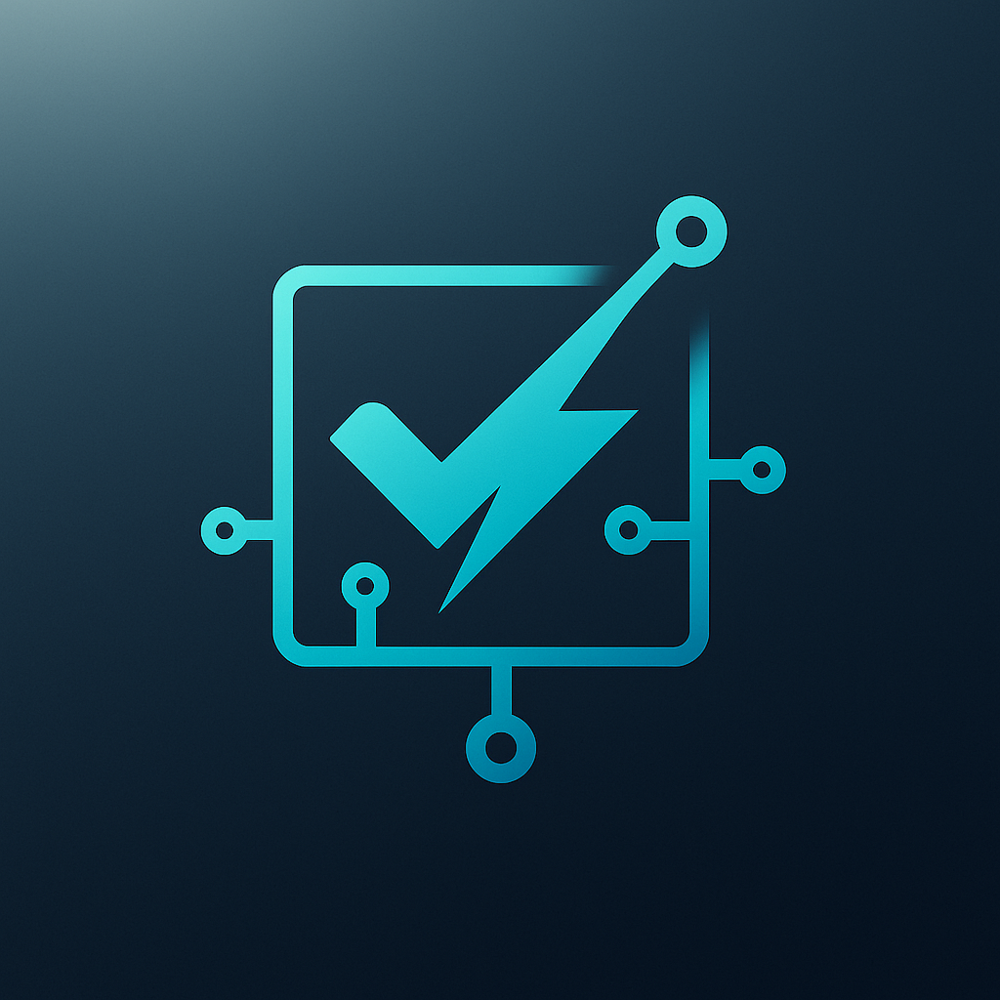

# ghostspec

<div align="center">
  

  <br/>
  <br/>

  **Built with Zig**
  
  
  
  
</div>

<br/>

GhostSpec is a comprehensive testing framework for Zig that provides property-based testing, fuzzing, benchmarking, and mocking capabilities.

## Installation

### Using Zig Fetch (Recommended)

Add GhostSpec to your project:

```bash
zig fetch --save https://github.com/ghostkellz/ghostspec/archive/refs/heads/main.tar.gz
```

Then add it to your `build.zig`:

```zig
const ghostspec = b.dependency("ghostspec", .{});
exe.root_module.addImport("ghostspec", ghostspec.module("ghostspec"));
```

### Manual Installation

1. Clone or download the repository
2. Copy the source files to your project
3. Add the module to your build configuration

## Features

- **Property-Based Testing**: Test properties that should hold for all inputs
- **Fuzzing**: Automatically find edge cases and bugs
- **Benchmarking**: Measure and compare performance
- **Mocking**: Isolate code under test with mock dependencies
- **Comprehensive Examples**: Real-world usage examples

## Quick Start

```zig
const std = @import("std");
const ghostspec = @import("ghostspec");

test "addition is commutative" {
    try ghostspec.property(struct{ a: i32, b: i32 }, testAdditionCommutative);
}

fn testAdditionCommutative(values: struct{ a: i32, b: i32 }) !void {
    try std.testing.expect(values.a + values.b == values.b + values.a);
}

test "simple benchmark" {
    try ghostspec.benchmark("addition", benchmarkAddition);
}

fn benchmarkAddition(b: *ghostspec.Benchmark) !void {
    b.iterate(|| {
        var result: i64 = 0;
        result += 1;
        result *= 2;
        _ = result;
    });
}
```

## Documentation

- [Getting Started](docs/getting-started.md)
- [API Reference](docs/api-reference.md)
- [Examples](docs/examples/)

## License

This project is licensed under the terms specified in the [LICENSE](LICENSE) file.
